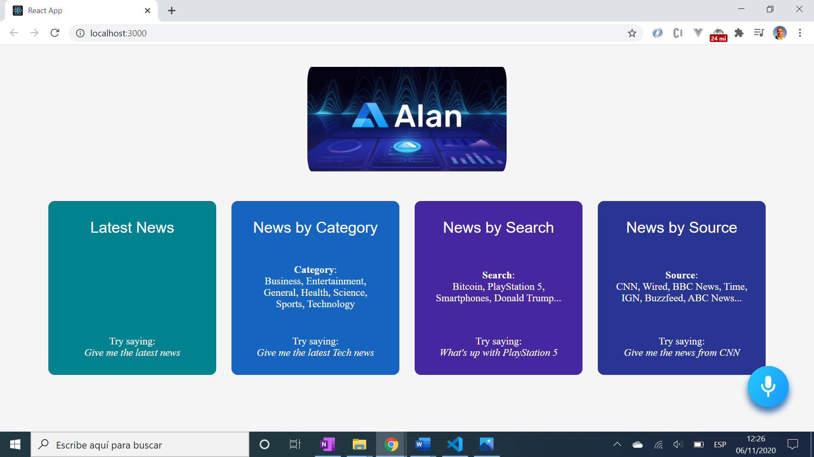
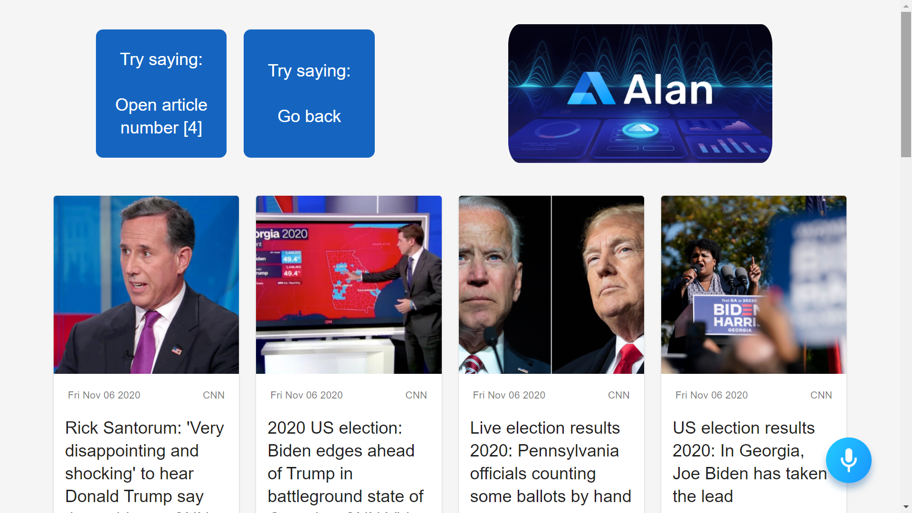

# :zap: React Speech Recognise

* React app using the [Alan Conversational Voice AI Platform](https://alan.app/platform) to get news from the [News API](https://newsapi.org/)
* Code from an excellent tutorial by [JavaScript Mastery](https://www.youtube.com/channel/UCmXmlB4-HJytD7wek0Uo97A) - see [:clap: Inspiration](#clap-inspiration) below. I have made a few minor changes.

## :page_facing_up: Table of contents

* [:zap: React Speech Recognise](#zap-react-speech-recognise)
  * [:page_facing_up: Table of contents](#page_facing_up-table-of-contents)
  * [:books: General info](#books-general-info)
  * [:camera: Screenshots](#camera-screenshots)
  * [:signal_strength: Technologies](#signal_strength-technologies)
  * [:floppy_disk: Setup](#floppy_disk-setup)
  * [:computer: Code Examples](#computer-code-examples)
  * [:cool: Features](#cool-features)
  * [:clipboard: Status & To-do list](#clipboard-status--to-do-list)
  * [:clap: Inspiration](#clap-inspiration)
  * [:envelope: Contact](#envelope-contact)

## :books: General info

* The [Alan AI Platform](https://alan.app/docs/tutorials/how-tos) allows user to request the Latest News, News by Category, News by Search and News by Source using voice commands
* News articles are displayed in a responsive grid using @material-ui templates
* The Alan AI has to be activated by clicking on the Alan AI button. After this all commands can be by voice.
* The quantity of [Alan AI free interactions](https://studio.alan.app/billing) has changed from what is shown in the Youtube tutorial. Only 50 free interactions were given. However, the Youtube tutorial has a Promo code `JSMASTERY` :clap: _that does indeed give you 2500 free interactions!_ :clap: You can further increase your interactions quota by 9 by starring their [9 pinned repos in Github](https://github.com/alan-ai)
* Note, the [subscription model for the news API](https://newsapi.org/pricing) changed some time back; it is only free for development. The API call is actually made from the Alan AI, which maybe gets round the CORS error 426 that occurs when trying to use the News API from a non-localhost server

## :camera: Screenshots




## :signal_strength: Technologies

* [React v17](https://www.python.org/) javascript framework
* [@alan-ai/alan-sdk-web](https://www.npmjs.com/package/@alan-ai/alan-sdk-web) npm package: Alan voice assistant SDK for Web
* [@material-ui/core](https://www.npmjs.com/package/@material-ui/core) npm package: React components framework
* [Alan advanced Voice AI Platform](https://alan.app/docs/usage/about) to add a voice interface backend to the app.
* [newsapi.org](https://newsapi.org/) worldwide news API
* [words-to-numbers](https://www.npmjs.com/package/words-to-numbers) npm package to convert words to numbers. The option to fuzzy match the words to numbers was used.

## :floppy_disk: Setup

* Follow tutorial [Javascript Mastery: Youtube: Build a Voice Recognition React News Application - Alan AI Voice Assistant](https://www.youtube.com/watch?v=rqw3OftE5sA) to create this app
* Run `npm i` to install dependencies
* Sign up and get yourself an API key for the [Alan Studio](https://alan.app/docs/usage/getting-started)
* Sign up and get yourself an API key for the [newsapi.org](https://newsapi.org/docs/get-started)
* A 'flexible javascript' code that includes intents as voice commands with replies has to be written in an Alan studio project. There is a copy of my version of this code in the file `backupAlan`
* Run `npm start` to run app on port `http://localhost:3000`

## :computer: Code Examples

* extract from the Alan AI project code that fetches news items from the News API using a user-specified search term. They are parsed to JSON then, if the JSON object is not empty, played if user confirmation received.

```javascript
api.request(NEWS_API_URL, (error, response, body) => {
  const { articles } = JSON.parse(body);

  if(!articles.length) {
    p.play('Sorry, try searching for something else.');
    return;
  }

  savedArticles = articles;

  p.play({ command: 'newsHeadlines', articles });
  p.play(`Here are the (latest|recent) articles on ${p.term.value}.`);

  p.play('Would you like me to read the headlines?');
  p.then(confirmation);

})
```

## :cool: Features

* @material-ui components save a lot of time with ready-made cards etc.
* Alan AI Voice Assistant has lots of cool features. These include a library of predefined scripts, including weather, bitcoin, translator etc. The Smalltalk predefined script was added, that 'gives responses to casual conversation'.
* The Alan AI voice activation command button appears on the bottom right of screen and looks quite cool.

## :clipboard: Status & To-do list

* Status: Working
* To-do: Some styling could be improved. This is a useful sandbox to play with Alan UI, including translation scripts. Alan UI website includes tutorial to add its UI to an Ionic App - a good future project.

## :clap: Inspiration

* [Javascript Mastery: Youtube: Build a Voice Recognition React News Application - Alan AI Voice Assistant](https://www.youtube.com/watch?v=rqw3OftE5sA)

## :envelope: Contact

* Repo created by [ABateman](https://www.andrewbateman.org) - you are welcome to [send me a message](https://andrewbateman.org/contact)
